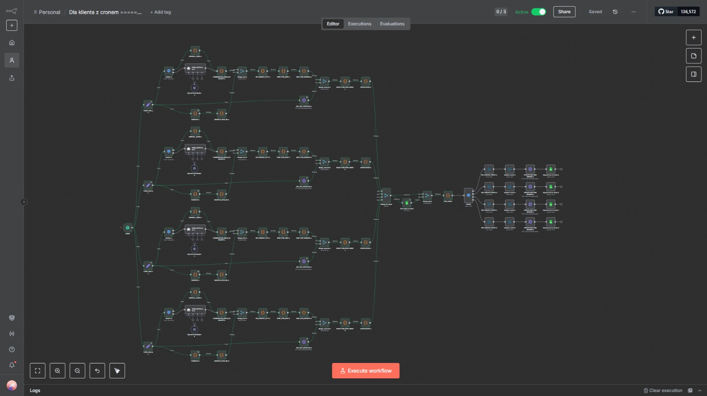
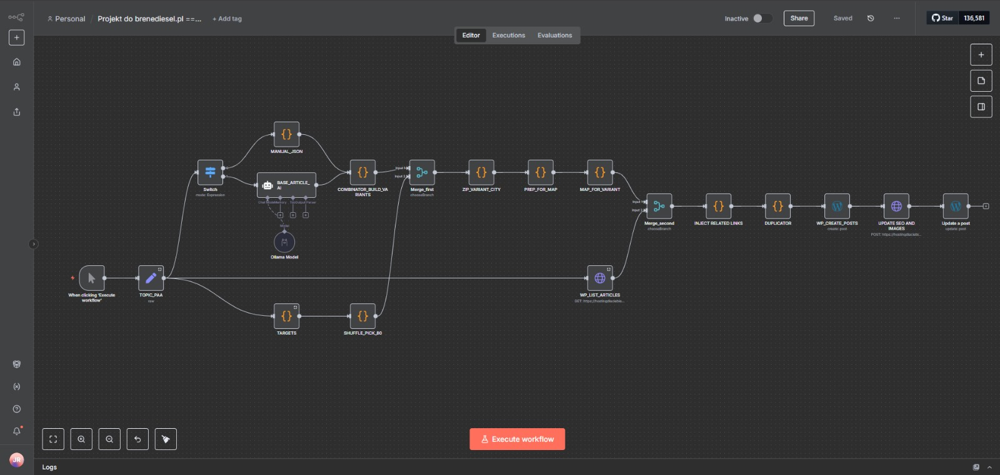
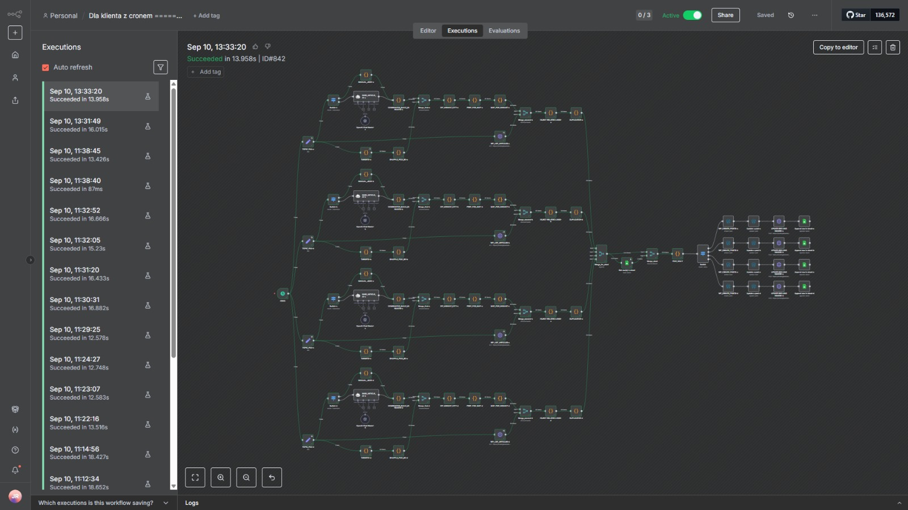

# WordPress AI Automation

This project demonstrates an **n8n automation pipeline** that integrates **OpenAI** with **WordPress** to automatically generate and publish blog posts.

## Features
- 📝 Generates **SEO-optimized content** using OpenAI (structured H2/H3, bullet points, meta description).
- 🖼️ Adds **featured images automatically** via WordPress media API.
- 📤 Publishes posts directly to WordPress with correct title, slug, and excerpt.
- ⚡ Reduces manual work for content managers by automating the full publishing flow.

## Tech Stack
- **n8n** – workflow automation
- **OpenAI API** – article generation and SEO metadata
- **WordPress REST API** – media upload & post publishing

## Screenshots
Here are some screenshots of the workflow and results:

### Workflow overview


### Single 80 Articles


### Executions workflow


## How it works (step-by-step)

1. **Trigger**
   - Automation starts manually, via a **Cron schedule**, or from a **Webhook**.

2. **Topic intake & validation**
   - Load a topic/keyword (from list, Notion, Google Sheets, or API).
   - Deduplicate to prevent duplicate posts.

3. **Outline & draft generation (OpenAI)**
   - Generate a structured outline with headings (H2/H3) and an excerpt/intro.
   - Expand each section into SEO-friendly copy with lists, formatting, and keywords.

4. **SEO & metadata**
   - Create title, slug, meta description, tags, and categories.
   - Ensure readability and keyword density.

5. **Image handling**
   - Generate or fetch a relevant image.
   - Upload via `POST /wp-json/wp/v2/media` and set it as the **featured image**.

6. **Build & publish post**
   - Compile the final JSON payload:  
     ```json
     {
       "title": "Example Article Title",
       "slug": "example-article-title",
       "content": "<h2>Intro</h2><p>Generated text...</p>",
       "status": "publish",
       "featured_media": 123
     }
     ```
   - Send to `POST /wp-json/wp/v2/posts`.

7. **Logging & QA**
   - Log execution data, catch errors, and retry if needed.
   - Notifications can be sent via email/Slack/Telegram.

## Future Improvements
- 🔍 Add keyword analysis for stronger SEO.
- 🔗 Automate internal linking between posts.
- 🎨 Integrate with AI image-generation tools.
- 📊 Track post performance with analytics (GA4, Search Console).

---

👤 **Author**: Jakub Róg  
📍 Poland / Remote  
🔗 [LinkedIn](https://www.linkedin.com/in/jakub-róg-a15152380/)
