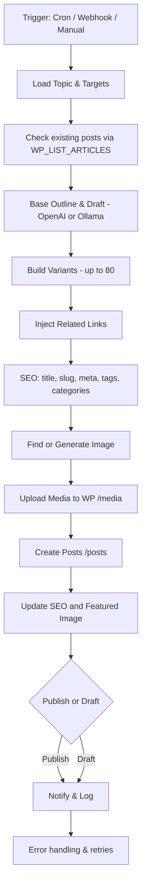

# WordPress AI Automation

This project demonstrates an **n8n automation pipeline** that integrates **OpenAI (or a local LLM via Ollama)** with **WordPress** to automatically generate and publish blog posts at scale.

## Features
- 📝 Generates **SEO-optimized content** using AI (H2/H3 headings, bullet points, meta descriptions).
- 🖼️ Adds **featured images automatically** via WordPress Media API.
- 🧩 Injects **internal related links** for better interlinking.
- 📤 Publishes posts directly to WordPress with correct **title, slug, and excerpt**.
- 🚫 Prevents duplicate posts by checking existing articles (`WP_LIST_ARTICLES`).
- ⚡ Automates full publishing flow, including batch mode (**up to 80 variants** per topic).
- 📦 Supports scaling for e-commerce, travel, or multi-location content.

## Tech Stack
- **n8n** – workflow automation  
- **OpenAI API / Ollama** – article + metadata generation  
- **WordPress REST API** – media upload & post publishing  

## Screenshots
Here are some screenshots of the workflow and results:

### Workflow overview


### Batch – 80 variants from a single topic


### Executions (runs overview)


## How it works (step-by-step)

1. **Trigger**
   - Workflow starts manually, on a **Cron schedule**, or via a **Webhook**.

2. **Topic intake & validation**
   - Load a topic/keyword (list, Notion, Google Sheets, or API).
   - Check against existing WordPress posts (`WP_LIST_ARTICLES`) to avoid duplicates.

3. **Base outline & draft (AI)**
   - Create a structured outline (H2/H3, intro, excerpt).
   - Expand each section into **SEO-friendly content** with keywords, lists, and formatting.
   - Supports **OpenAI** and **Ollama** (local LLM).

4. **Build variants (batch mode)**
   - Generate up to **80 content variations** from one topic (e.g., different cities or products).
   - Use `COMBINATOR_BUILD_VARIANTS`, `ZIP_VARIANT_CITY`, and mapping functions.

5. **Internal linking**
   - `INJECT RELATED LINKS` adds interlinks to improve SEO and navigation.

6. **SEO & metadata**
   - Generate **title, slug, meta description, tags, and categories** dynamically.
   - Apply keyword density and readability checks.

7. **Image handling**
   - Fetch or generate relevant images.
   - Upload via `POST /wp-json/wp/v2/media` and set as the **featured image**.

8. **Create & update posts**
   - Compile the final payload and create posts:  
     ```json
     {
       "title": "Example Article Title",
       "slug": "example-article-title",
       "content": "<h2>Intro</h2><p>Generated text...</p>",
       "status": "publish",
       "featured_media": 123
     }
     ```
   - Send to `POST /wp-json/wp/v2/posts`.  
   - Run `Update post` step to attach images/SEO fields.

9. **Logging & QA**
   - Log execution data.
   - Catch errors, retry failed steps.
   - Send notifications via email/Slack/Telegram.

## Architecture Diagram



## Future Improvements
- 🔍 Add keyword analysis for stronger SEO.
- 🔗 Automate internal linking between posts.
- 🎨 Integrate with AI image-generation tools.
- 📊 Track post performance with analytics (GA4, Search Console).

---

👤 **Author**: Jakub Róg  
📍 Poland / Remote  
🔗 [LinkedIn](https://www.linkedin.com/in/jakub-róg-a15152380/)
